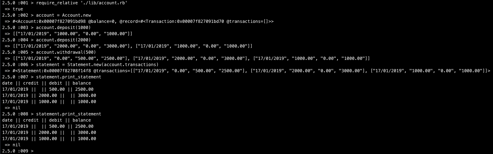

Bank Tech Test
=================
[](https://travis-ci.org/kiedunne/bank-tech-test)
[](https://codecov.io/gh/kiedunne/bank-tech-test)


### Local Setup

```
git clone https://github.com/kiedunne/bank-tech-test.git
cd bank-tech-test
bundle install
```

### Example Usage

To make a 1000 deposit, 2000 deposit, 500 withdrawal, and see a printed statement, open irb and input the following commands:

```
require_relative './lib/account.rb'
account = Account.new
account.deposit(1000)
account.deposit(2000)
account.withdrawal(500)
statement = Statement.new(account.transactions)
statement.print_statement
```
statement output:
```
date || credit || debit || balance
16/01/2019 ||  || 500.00 || 2500.00
16/01/2019 || 2000.00 ||  || 3000.00
16/01/2019 || 1000.00 ||  || 1000.00
```
example interaction:


### Run Tests

All unit and feature tests are run with rspec. Code coverage is 100%
```
cd bank-tech-test
rspec
```

### Run Linter

Run linter with rubocop. Code contains zero offenses.
```
rubocop
```

### Technology

* Ruby
* RSpec
* Rubocop
* Coveralls
* SimpleCov
* Travis CI

### Approach

* Review program requirements and diagram potential classes and their methods
* Write a feature test in pseudo code, then break down into smaller unit unit
* Write unit test, let it fail, then implement small lines of code to pass each unit test
* Refactor each class in line with the Single Responsibility Principle(SRP)
* Commit changes
* Repeat process for each unit test

### Requirements

* You should be able to interact with your code via a REPL like IRB or the JavaScript console.  (You don't need to implement a command line interface that takes input from STDIN.)
* Deposits, withdrawal.
* Account statement (date, amount, balance) printing.
* Data can be kept in memory (it doesn't need to be stored to a database or anything).

### Acceptance criteria

**Given** a client makes a deposit of 1000 on 10-01-2012  
**And** a deposit of 2000 on 13-01-2012  
**And** a withdrawal of 500 on 14-01-2012  
**When** she prints her bank statement  
**Then** she would see

```
date || credit || debit || balance
14/01/2012 || || 500.00 || 2500.00
13/01/2012 || 2000.00 || || 3000.00
10/01/2012 || 1000.00 || || 1000.00
```
